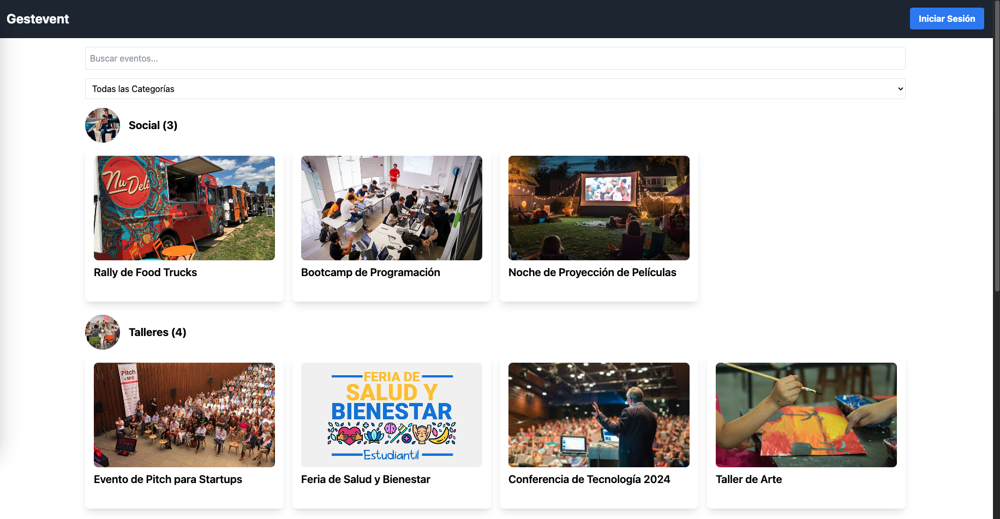
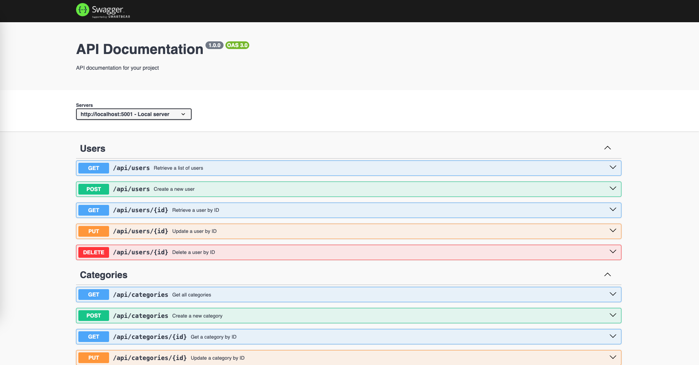

# Gestion de Eventos

Este proyecto es una aplicación web para la gestión de eventos. Permite a los usuarios crear y gestionar eventos, con diferentes roles y permisos. La aplicación ofrece funcionalidades de administración de eventos, gestión de usuarios, y una interfaz de usuario para la visualización y administración de eventos.

## Tecnologías Utilizadas

- **Backend**: Node.js, Express.js
- **Base de Datos**: MongoDB
- **Frontend**: React.js (JavaScript)

## Instalación

Para configurar y ejecutar el proyecto en tu máquina local, sigue estos pasos:

### 1. Clonar el Repositorio

```bash
git clone https://github.com/JoseJulian29/gestion_eventos.git
cd gestion_eventos
```

### 2. Configurar el Backend
Navega al directorio del backend:
```bash
cd backend
```
Instala las dependencias:
```bash
npm install
```
Configura las variables de entorno. Crea un archivo .env en el directorio del backend.
```makefile
MONGODB_URI=<TU_URI_DE_MONGODB>
PORT=<PORT>
```
Inicia el servidor:
```bash
npm run dev
```

### 3. Configurar el Frontend
Navega al directorio del frontend:
```bash
cd frontend
```
Instala las dependencias:
```bash
npm install
```
Inicia el servidor:
```bash
npm run dev
```

### Características Principales

#### Administración de Eventos
Crear Categorías de Eventos: Los administradores pueden crear categorías de eventos (por ejemplo, Conferencias, Talleres, Social).
Crear Eventos: Los usuarios pueden crear eventos con los siguientes campos:
- Título
- Descripción
- Banner
- Logo
- Fecha
- Hora
- Ubicación
Validaciones:

Evita duplicación de títulos de eventos dentro de la misma categoría.
Valida fechas y horas.
Evita duplicación de categorías.
#### Gestión de Usuarios
Tipos de Usuarios:
- Taquilla (Admin): Permite CRUD (Crear, Leer, Actualizar, Eliminar)
- Organizador: Permite CRU (Crear, Leer, Actualizar)
- Participante: Solo lectura (R)
Campos de Registro:

- Nombre de usuario
- Correo electrónico
Validaciones:

- Evita duplicación de usernames y correos.
- Permisos de Usuario: Valida permisos de usuario en toda la aplicación.

#### Gestión de Eventos

Lista de Eventos: 
- Muestra eventos ordenados por fecha y categoría. 
- Los participantes pueden ver los eventos.
- Los visitantes pueden ver solo información básica de los eventos.
- Cada categoría puede tener una imagen de portada representativa.

#### Funcionalidades Frontend
Vista de Eventos: Muestra eventos disponibles según categoría y fecha.

Contadores de eventos por categoría. Actualización en tiempo real de contadores y estados de eventos.

Buscadores:
- Buscador de categoría.
- Buscador de nombre de evento.

Agregar Eventos:

- Los organizadores pueden agregar y editar eventos.
- Validaciones para campos requeridos y ordenación de eventos.
- Validación de Archivos: Asegura que los archivos cargados sean adecuados para su tipo (imágenes). (Solo alcance a agregar la validacion de imagen a la creacion de categorias)
- Gestión de Usuarios: Permite a los usuarios tipo taquilla gestionar otros usuarios de manera intuitiva.

### Pruebas con Jest

Se han implementado pruebas unitarias utilizando Jest para asegurar la calidad y funcionalidad del código. Las pruebas se encuentran en el directorio backend/tests.

Ejecutar las Pruebas
Para ejecutar las pruebas, sigue estos pasos:

Navega al directorio del backend:
```bash
cd backend
```
```bash
npm test
```

Las pruebas se ejecutarán y mostrarán los resultados en la consola. 

### Documentación de la API con Swagger

La documentación de la API está disponible a través de Swagger UI. Esta documentación proporciona una interfaz interactiva para explorar y probar los endpoints de la API.

Acceder a la Documentación
Inicia el servidor del backend si no lo has hecho:
```bash
npm run dev
```
Abre tu navegador web y navega a:
```bash
http://localhost:5001/api-docs
```
Aquí encontrarás la documentación completa de los endpoints disponibles en la API, junto con ejemplos de solicitudes y respuestas.

### Screenshots del proyecto

#### Lista de Eventos



#### Login


#### Registro


#### Admin home


#### Crud de usuarios


#### Modal para usuario


#### Crud de categorias


#### Modal de categoria


#### Modal de eventos

Aqui me hizo falta validar correctamente la subida de imagen, por el momento solo se puede agregar una url para los campos banner y logo, si se agrega una url de la web valida, se mostrará correctamente la imagen


#### Documentacion de la api


